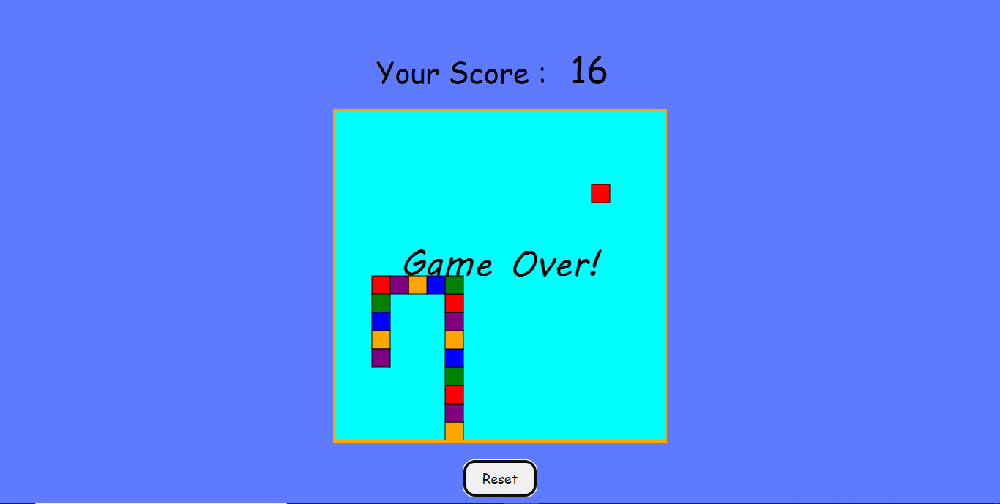
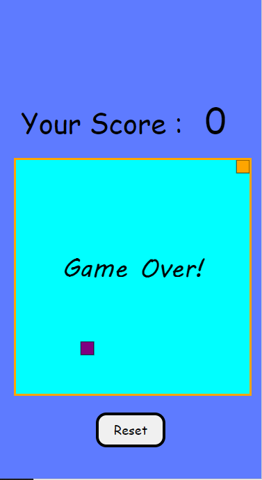

# Snake Game in JavaScript

Welcome to the Snake Game implemented in JavaScript! This classic arcade game allows you to control a snake and try to eat as much food as possible without colliding with the walls or yourself.

## Table of Contents
- [Demo](#demo)
- [Features](#features)
- [Screenshot](#Screenshots)
- [How to Play](#how-to-play)
- [Contributing](#contributing)
- [License](#license)

## Demo
Check out the live demo of the Snake Game [here]([https://tanrandel.github.io/SnakeGame-JavaScript-/)]).

## Features
- Classic Snake gameplay with a responsive and user-friendly interface.
- The snake grows longer after consuming food.
- Simple and intuitive controls using arrow keys.
- Game over screen with the option to restart the game.

## Screenshots

## How to Play

- Use the arrow keys (Up, Down, Left, and Right) to control the snake's direction.
- Try to eat the food represented by the red squares.
- The snake will grow longer every time it eats food.
- Avoid running into the walls or colliding with the snake's body.
- The game ends when you collide with the walls or yourself.
- Your score and high score are displayed on the screen.

## How to Play
-Use the arrow keys (Up, Down, Left, and Right) to control the snake's direction.
- Try to eat the food represented by the red squares.
- The snake will grow longer every time it eats food.
- Avoid running into the walls or colliding with the snake's body.
- The game ends when you collide with the walls or yourself.
- Your score and high score are displayed on the screen.
